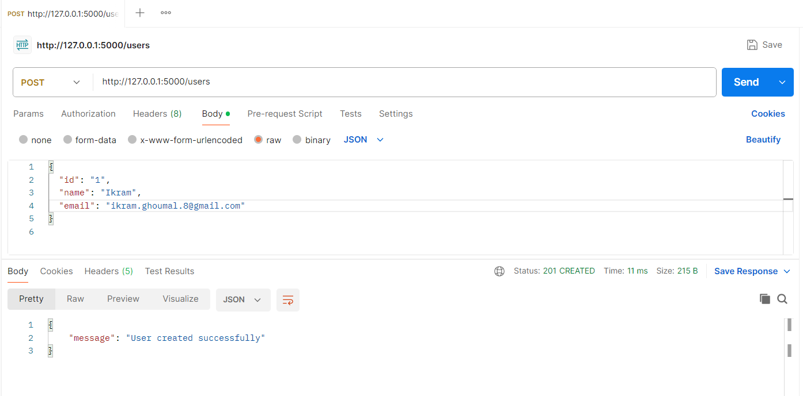
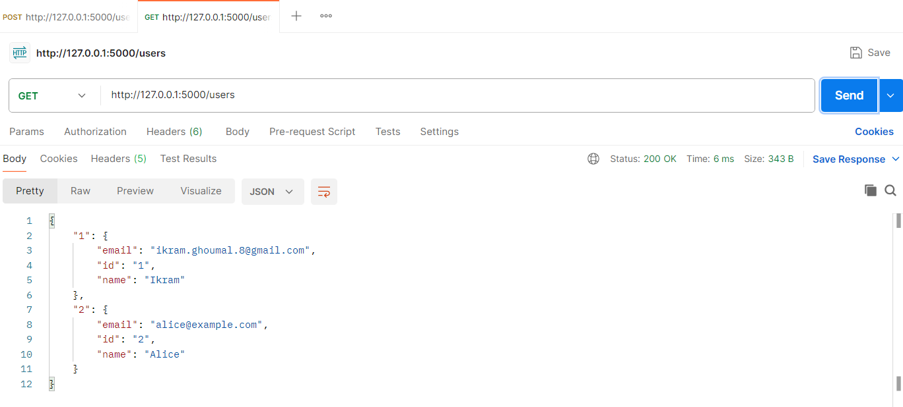
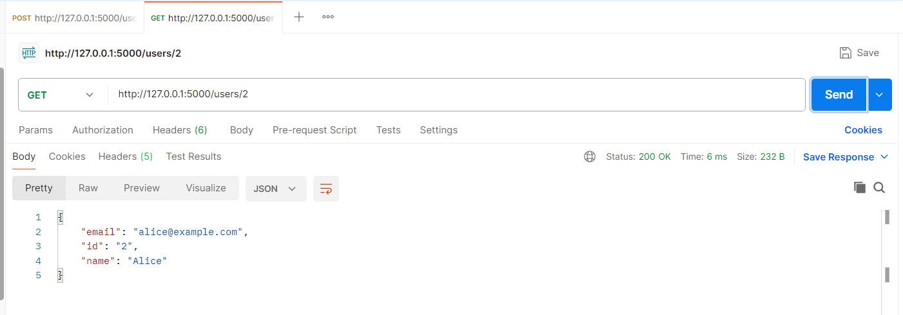
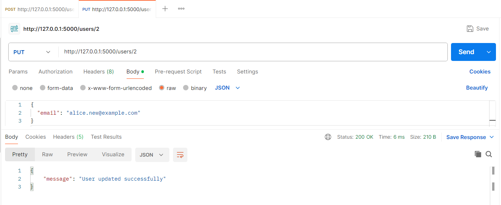
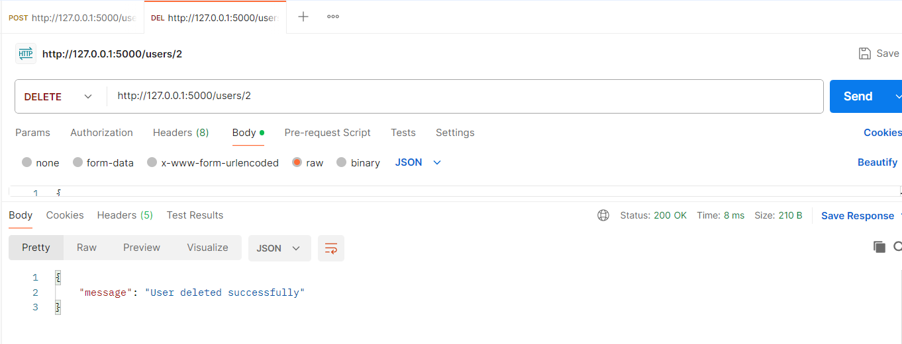

# REST-API-with-Flask
This is a simple Flask-based demo written in Python. It provides a REST API for basic user data management using in-memory storage (a Python dictionary), supporting standard CRUD operations.

## Technologies Used

- Python 3.13.2
- Flask 3.1.0
- Postman 11.55.0 (for testing)
- JSON (data format)

---

## Objective

To build a REST API that can:
- Create users.
- Retrieve all users or a specific user by ID.
- Update user informations.
- Delete users.

  <h2>📸 API Testing Screenshots</h2>

  <h3>1. POST /users – Create User</h3>
  
  
Creating a new user using the POST method.

  <h3>2. GET /users – Get All Users</h3>
  
  
Retrieving the list of all users stored in memory.

  <h3>3. GET /users/&lt;id&gt; – Get User by ID</h3>
  
  
Retrieving a single user by their unique identifier using the GET method.

  <h3>4. PUT /users/&lt;id&gt; – Update User</h3>
  
  
Updating user information by ID using the PUT method.

  <h3>5. DELETE /users/&lt;id&gt; – Delete User</h3>
  

Deleting a user by ID using the DELETE method.

